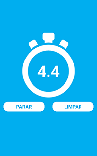

  <a href="https://www.linkedin.com/in/humberto-constantino-8b6243184/" target="_blank">Linkedin<a>

 

  Cronômetro

  
  
  
  

## :rocket: Technologies

Technologies used in the project:

- [Node.js](https://nodejs.org/en/)
- [React Native](https://facebook.github.io/react-native/)

## 💻 Project

This is a stopwatch application that works on Android and IOS.
Whith recourses of go and stop.
